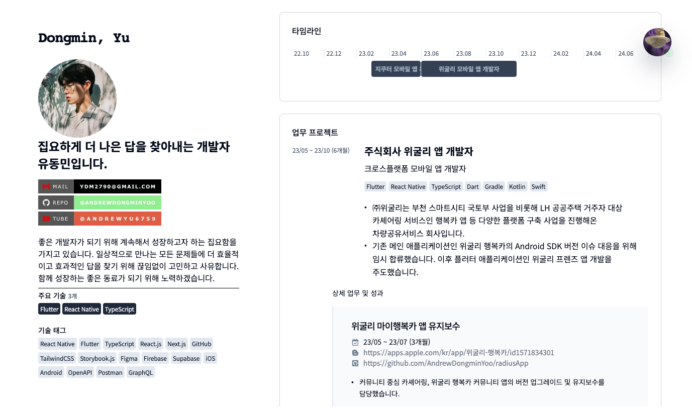
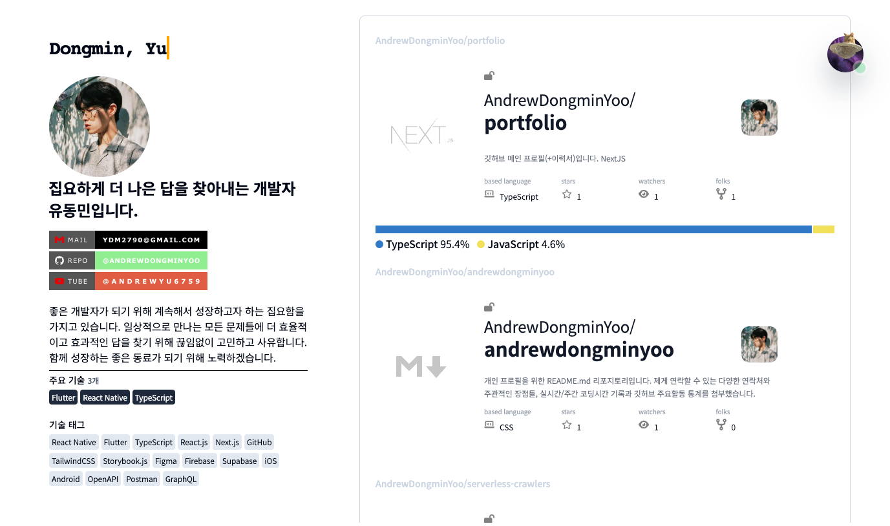

# My Public Resume and Portfolio Website

## Preview (Desktop)





## Preview (Mobile)

|  |  |  |
| --- | --- | --- |

## YOO DONG MIN :: WHO I AM

I am a former chef who decided to pursue a career in development during the COVID-19 pandemic. I started teaching myself web scraping using Python and later picked up React Native. I then completed a national support program for Java Spring development and became a backend developer. I also worked on Flutter applications before landing a job as a React Native developer. I really appreciate the productivity-focused and growth-oriented culture of the development industry, and I want to help beginners overcome their anxieties and uncertainties. I believe that there is a lot of room for growth in the mobile app industry, and I am excited to continue my journey as a developer.

저는 전직 요리사였으며 코로나19 팬데믹에 의한 실업급여 기간 동안 개발에 빠져 이 분야에서 경력을 쌓기로 결심했습니다. 파이썬을 사용하여 웹 스크래핑을 스스로 배우기 시작했고 나중에 React Native를 선택했습니다. 그 후 Java Spring 개발을 위한 국가 지원 프로그램을 수료하고 백엔드 개발자가 되었습니다. 첫 업무는 Django 백엔드 개발자로 시작했지만, 좋은 기회로 Flutter 애플리케이션 개발을 하게 되었으며, 현재는 리액트 네이티브 개발자로 일하고 있습니다. 저는 생산성 중심적이고 성장 지향적인 개발 업계의 문화를 정말 좋아하며, 과거의 저와 같은 입문자들이 불안과 불확실성을 극복할 수 있도록 돕고 싶습니다. 모바일 앱 업계에는 성장의 여지가 많다고 생각하며, 개발자로서의 여정을 계속 이어갈 수 있게 되어 기쁩니다.

## ABOUT THIS PROJECT

After completing a backend development training course and looking for a job, I saw a lot of developer blogs and awesome resumes publicly posted by other developers, so I decided I wanted to do a project that could be both a resume and a personal portfolio, so I started with a static HTML+CSS+JS GitHub page, migrated to Next.js, which I'm very interested in, and now have a printable resume page that's SEO optimized and has a lot of fun dynamic elements. I currently have a github.io page redirecting to this site, but I plan to merge the projects into a personal domain.

백엔드 개발 교육 과정을 마치고 일자리를 찾던 중 다른 개발자들이 공개적으로 올린 개발자 블로그와 멋진 이력서를 많이 보고 이력서와 개인 포트폴리오를 겸할 수 있는 프로젝트를 해보고 싶다는 생각이 들어 정적인 HTML+CSS+JS 깃허브 페이지로 시작해서 제가 관심이 많은 Next.js로 마이그레이션한 후 SEO에 최적화되고 재미있는 동적 요소가 많이 포함된 인쇄 가능한 이력서 페이지를 만들게 되었어요. 현재 이 사이트로 리디렉션되는 github.io 페이지가 있지만 프로젝트를 개인 도메인으로 병합할 계획입니다.

## 프로젝트에 사용된 의존성 패키지 (계속해서 추가될 예정)

- `next`: Next.js를 구현하는 라이브러리
- `@next/env`: Next.js의 기본 플러그인을 바인딩. 빌드 환경과 실행 환경의 환경 변수에 접근 가능.
- `next-sitemap`: Next.js 빌드 시 sitemap.XML 생성.
- `eslint-config-next`: Next.js의 기본 Eslint 구성. ESLint는 프로젝트에 따라 각종 조건과 규칙을 준수하기 위한 도구
- `react`: 페이스북에서 개발한 방식 (JSX)으로 사용자 인터페이스를 만들기 위한 자바스크립트 라이브러리.
- `react-dom`: 서버사이드 렌더링 기능을 함께 제공하고 재사용성을 보장.

- `tailwindcss`: Utility-First CSS 프레임워크로 버그 수정 및 디자인 시스템 적용에 용이.
- `autoprefixer`: 특정 CSS 프로퍼티에 필요한 prefix를 고려하여 통합하는 PostCSS 프론트엔드 웹 자동화 프레임워크.
- `postcss`: Postcss 기본 플러그인이나 폴리필 필요시 추가
- `@headlessui`: TailwindCSS 기반 ReactUI 라이브러리
- `@fortawesome`: 리액트 프로젝트용 font-awesome 아이콘 컴포넌트.
- `cssnano`: 규칙 베이스 CSS 최적화 엔진.
- `classnames`: React.js의 클래스 속성을 조인하기위한 라이브러리.
- `tailwind-scrollbar-hide`: TailwindCSS 명시적으로 선언하지 않은 스크롤바 숨기기

- `eslint`: Javascript 복잡성을 발견하고 이를 자동으로 수정하기위한 JavaScript 개발 도구.
- `eslint-config-prettier`: 현재 프로젝트의 마지막 ESLint 구성에서 Prettier와 충돌하는 ESLint 규칙을 비활성화하기위한 구성.
- `eslint-plugin-jest-dom`: Jest DOM를 사용하기 위한 ESLint 플러그인. Jest는 객체 모사와 Jest-dom은 브라우저의 함수를 모킹하기 위해 사용.
- `eslint-plugin-prefer-arrow`: 함수를 선언할 때 권장되는 작성 규칙을 체크하도록 하는 ESLint 플러그인.
- `eslint-plugin-react`: React 컴포넌트에 대해 정적 분석을 수행하는 ESLint 플러그인.
- `eslint-plugin-testing-library`: 권장 규칙을 검사할 때 @testing-library/react-hooks 플러그인
- `prettier`: 다양한 언어를 지원하는 코드 포맷터

- `openai`: OpenAI GPT3.5 Turbo 등의 언어 모델과 연동
- `gpt-3-encoder`: OpenAI GPT3 Encoder. OpenAI API의 입출력에 사용.
- `@octokit`: GitHub Api(octokit)를 자동으로 생성함
- `axios`: 내부 API 및 외부 API를 연결하기 위한 프로미스 기반 HTTP 클라이언트.

- `date-fns`: 날짜 기능 라이브러리. moment는 2.6MB 인 반면에 date-fns 라이브러리는 124KB 내외.
- `gray-matter`: 메타 데이타와 내용 사이의 front matter를 파싱하고 집계 가능. 마크다운 문서를 자동으로 인식하기위한 가장 좋은 방법.
- `is-core-module`: node.js의 핵심 모듈을 판별.
- `lodash.groupby`: 배열을 사용하여 해시테이블 또는 해시 테이블 당 하나의 요소를 구성하고 배열성 객체의 요소에 따라 구성된 그룹의 배열을 반환하는 함수.
- `nanoid`: 프론트엔드 세션에 사용될 수 있는 이식성 임의 식별자 생성기.
- `sharp`: Node.js용 라이브러리 IPC. 이미지 리사이즈의 단일 큐 처리 도구

- `typescript`: 자바스크립트의 슈퍼셋이라 할 수 있는 TypeScript는 자바스크립트의 정적버전을 제공하고 제한하며, TDD 및 디버깅 성능도 높임.
- `@typescript-eslint`: 타입스크립트를 사용할 때, ESLint에 더 상세한 설정의 타입 린트를 사용할 수 있도록 도와주는 도구.
- `@types`: TypeScript에 사용할 수 있는 타입 선언파일. Definitely typed 오픈소스로 라이브러리의 타입 스크립트 버전을 추가.
- `ts-node`: Typescript로 작성된 Node.js 기반의 JavaScript 코드를 인터프리터로 실행할 수 있도록 도와주는 라이브러리.
- `ts-unused-exports`: TS 프로젝트의 사용되지 않는 변수와 함수를 리포트 해주는 명령줄 도구.
- `webpack`: 대표적인 빌드 도구로, 모듈 관리, 런타임에 코드가 바뀌었을 때 코드를 관리해주고 웹팩 최신 문법으로 변역해 동적으로 로딩.

- `jest`: JavaScript 테스팅 프레임워크로 테스트 결과를 html로 결과화 가능.
- `ts-jest`: 자바스크립트 테스트 백엔드인 Jest와 Typescript를 아주 편하게 연동할 수 있게 도와주는 커스텀 라이브러리.
- `jest-resolve`: jest의 리졸버로 오류를 수정하는 karma-stub-resolve에 대한 해결책인 mock-requires를 추가하는데 사용
- `@testing-library`: 로직 테스팅을 위한 라이브러리.
- `next-router-mock`: Next.js jest 테스트를 보다 편하게 할 수 있도록 커스터마이징 된 mock version

## 프로젝트 폴더 구조

- `__mocks__/`: 테스트를 위한 목 모델 _폴더_
- `__tests__/`: 테스트와 테스트에 쓰이는 스냅샷을 위한 _폴더_
- `.next/`: 자동 생성되는 .next 캐싱 _폴더_
- `.trunk/`: 다양한 린터/포맷터를 컨트롤할 수 있는 trunk _폴더_
- `.vscode/`: VScode 환경 설정 공유 _폴더_
- `components/`: 공통 컴포넌트 _폴더_
- `constants/`: 프로젝트 내 전역에서 쓰이는 상수 _폴더_
- `data/`: 정적 데이터 _폴더_ (JSON, MD 파일 등)
- `lib/`: 공통 함수 및 로직 _폴더_
- `node_modules/`: npm을 통해 설치하는 라이브러리 _폴더_
- `pages/`: 페이지에 관한 모든 파일이 있는 라우터 _폴더_. 폴더명이 라우팅 URL로 쓰임.
- `public/`: image, fonts 등 static 파일 _폴더_
- `styles/`: 프로젝트 내 전역 스타일 관리 _폴더_
- `types/`: interface, type 관리 _폴더_

## 실행 방법

클론 아래 코드 중 하나를 실행합니다.

```shell
git clone https://github.com/AndrewDongminYoo/AndrewDongminYoo.vercel.git resume
git clone git@github.com:AndrewDongminYoo/AndrewDongminYoo.vercel.git resume
gh repo clone AndrewDongminYoo/AndrewDongminYoo.vercel resume

cd resume
```

환경 변수 설정

```shell
cp .env.sample .env
```

```log
NODE_ENV='development'|'production'|'test' 중 선택
GITHUB_TOKEN="깃허브 토큰 입력" (리포지토리 조회 권한 포함)
```

실행하는 방법

```shell
$ cd resume && yarn install && yarn dev
> yarn run v1.22.19
> ready - started server on 0.0.0.0:3000, url: http://localhost:3000
> info  - Loaded env from ~/Desktop/CodeProjects/AndrewDongminYoo.vercel/.env
> event - compiled client and server successfully in 340 ms (194 modules)
```

기타 스크립트는 package.json에 모두 작성되어 있으므로 생략합니다.

## Deploy your own

Deploy the example using [Vercel](https://vercel.com?utm_source=github&utm_medium=readme&utm_campaign=next-example) or preview live with [StackBlitz](https://stackblitz.com/github/vercel/next.js/tree/canary/examples/blog-starter)

[](https://vercel.com/new/git/external?repository-url=https://github.com/vercel/next.js/tree/canary/examples/blog-starter&project-name=blog-starter&repository-name=blog-starter)

## How to use

Execute [`create-next-app`](https://github.com/vercel/next.js/tree/canary/packages/create-next-app) with [npm](https://docs.npmjs.com/cli/init), [Yarn](https://yarnpkg.com/lang/en/docs/cli/create/), or [pnpm](https://pnpm.io) to bootstrap the example:

```bash
npx create-next-app --example blog-starter resume
```

```bash
yarn create next-app --example blog-starter resume
```

```bash
pnpm create next-app --example blog-starter resume
```

Your blog should be up and running on [http://localhost:3000](http://localhost:3000)! If it doesn't work, post on [GitHub discussions](https://github.com/vercel/next.js/discussions).

Deploy it to the cloud with [Vercel](https://vercel.com/new?utm_source=github&utm_medium=readme&utm_campaign=next-example) ([Documentation](https://nextjs.org/docs/deployment)).
